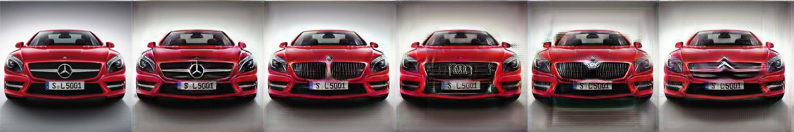

# Car2Car

Image to image translation using a modifed version of StarGAN(https://github.com/yunjey/stargan). Transforms a car to a target make.
The datasets we used are from:
- http://mmlab.ie.cuhk.edu.hk/datasets/comp_cars/
- https://ai.stanford.edu/~jkrause/cars/car_dataset.html

More in the project report 

## Training

 1. put your data under ./data  (name format: domainTag-name.jpg; e.g., 1-audiA3.jpg)
 2. start anaconda environment with the given environment.yml
 3. run training_command.sh (adjust parameters if necessary)

